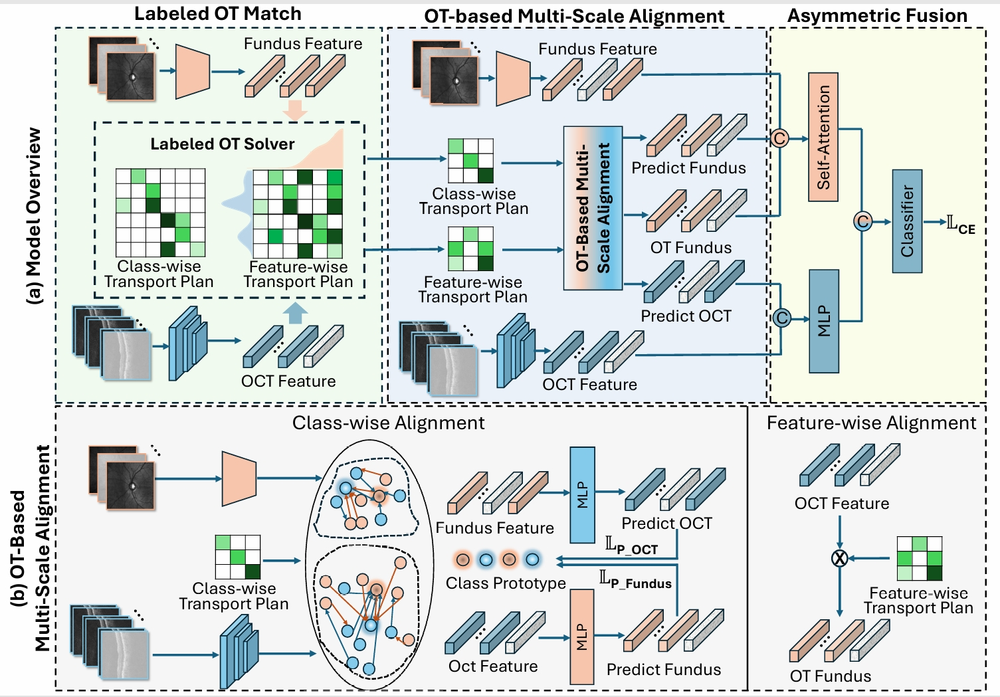

# Robust-Incomplete-Modality-Alignment-for-Ophthalmic-Disease-Grading-and-Diagnosis-via-Labeled-OT
MICCAI 2025 early accept
## Introduction
Multimodal ophthalmic imaging-based diagnosis integrates colour fundus imaging with optical coherence tomography (OCT) to provide a comprehensive view of ocular pathologies. 
However, the uneven global distribution of healthcare resources often results in real-world clinical scenarios encountering incomplete multimodal data, which significantly compromises diagnostic accuracy. 
Existing commonly used deep learning pipelines, such as modality imputation and distillation methods, face notable limitations: (1) Imputation methods struggle with accurately reconstructing key lesion features because OCT lesions are localized, while fundus images vary in style Meanwhile, 2) distillation methods rely heavily on fully paired multimodal training data. To address these challenges, we propose a novel multimodal alignment and fusion framework capable of robustly handling missing modalities in the task of ophthalmic diagnostics. 
By taking into account the distinctive feature characteristics of OCT and fundus images, we emphasise the alignment of semantic features within the same category and explicitly learn soft matching between modalities, building a bridge between the two modalities so that the missing modality can utilize the information of the existing modality, achieving robust cross-modal feature alignment under the missing modality. Specifically, we leverage the Optimal Transport (OT) mechanism for multi-scale modality feature alignment: class-wise alignment through predicted class prototypes and feature-wise alignment via cross-modal shared feature transport. Furthermore, we propose an asymmetric fusion strategy that effectively exploits the distinct characteristics of OCT and fundus modalities. Extensive evaluations on three large-scale ophthalmic multimodal datasets demonstrate our model's superior performance under various modality-incomplete scenarios, achieving state-of-the-art performance in both complete modality and inter-modality incompleteness conditions.
<p align="center">
  
</p>

## Before start
### download pretrain 3D-Resnet here
[link](https://drive.google.com/drive/folders/1Ytyg8pmAU0zSXDxY4klxw-BZW8Q-jBQ0?usp=sharing).
replace pretrain path at file ./Models/generate_model.py line 113
## train 
```bash
python main.py
```
## train or test
```bash
python test.py
```
## checkpoint for Complete-Modality Fusion
[link](https://drive.google.com/drive/folders/1beYPA-ucO5Rpq8mXjflPeTGAbl1Dwulz?usp=sharing).

## datasets
from [Harward-30K](https://drive.google.com/drive/folders/1sLX2O_0AlrjY6JmdKijiV1zducsOsd0m)

